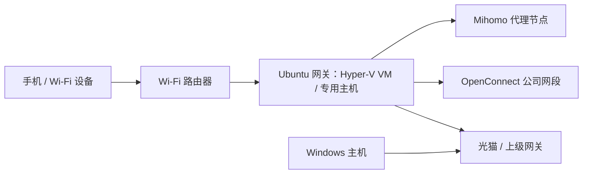

# Home Gateway

在 Windows Hyper-V 的 Ubuntu 虚拟机或专用 Ubuntu 主机上运行 Mihomo 和 OpenConnect，让局域网设备共用代理、公司 VPN 和 DNS。两种方式使用同一镜像、配置格式和维护工具。以一个有线网口的家庭网关为目标，优先考虑日常维护和故障排查。



Wi-Fi 路由器的 WAN 网关和 DNS 指向 Ubuntu 网关。使用 Hyper-V 时，Windows 主机可以继续使用上级网关，便于修复虚拟机。此项目只处理 IPv4；下游路由器应关闭 IPv6，避免流量绕开网关。

## 已实现

- OpenConnect 自动采用服务器下发的 IPv4 网段和 DNS，拒绝意外的全隧道路由。
- VPN profile 支持密码与 TOTP；种子在 pass 中保存，部署时渲染成只读令牌文件。
- Mihomo 透明代理；公司网段优先走 VPN，普通流量采用完整 Clash 订阅中的节点、分组和规则。
- 每日更新订阅，保留本地网关配置、API 密钥和节点选择。更新失败继续使用上次有效配置；节点删除时按配置的地区筛选回退。
- MetaCubeXD 网页面板，在受限的局域网地址监听并要求 API 密钥。
- VPN 有限重试；Mihomo 最多重试三次。可分别查看日志、停止或手动重试。
- 配置只读挂载，镜像不含个人配置；部署先验证，再切换，已有部署失败时回退。
- GPG 加密状态备份，恢复订阅缓存、地区数据库和节点选择。
- 部署时同步管理端公钥文件；Hyper-V 首次创建也使用同一授权列表。

## 内容放在哪里

| 内容 | 位置 | Git 管理 |
|---|---|---|
| 镜像构建、网关逻辑、管理工具、示例 | 本仓库 | 公开 |
| 目标地址、平台参数、VPN 服务端/用户名、凭据引用 | 默认 pass 的 `home-gateway/deployment`、`vpn/profiles` | 加密文件可由私有 yadm 跟踪 |
| 订阅 URL、面板密钥、VPN 密码、TOTP 种子 | pass 的独立条目；可复用已有 VPN 凭据 | 加密文件可由私有 yadm 跟踪 |
| 自动生成的管理缓存 | 操作机 `~/.config/home-gateway/deployment.json` | 本地生成，不跟踪 |
| SSH 登录公钥列表 | 操作机 `connection.AuthorizedKeysFile` 指定的文件 | 可由私有 yadm 跟踪 |
| 渲染后的配置和密码 | 网关 `/opt/home-gateway/config` | 不进入公开仓库 |
| 订阅缓存、数据库、面板选择、日志 | 网关 `/opt/home-gateway/data` | 加密备份；日志不备份 |
| SSH/GPG 私钥、VM 磁盘、离线镜像 | 操作机独立存储 | 不进入 Git |

网关不需要安装 yadm、pass、个人 shell 配置或 GPG 私钥。管理端只需相关的加密条目与 SSH/GPG 密钥，无需整个私有 yadm checkout，也无需 `home-gateway` class。部署时解密必要数据，通过 SSH 发送最小运行配置；之后网关可以独立重启。平台参数不会进入容器。

## 部署

操作机需要 Python 3.12+、PyYAML、SSH、GPG 和 pass。Windows 使用 WSL 运行共享工具，Hyper-V 管理使用 PowerShell；Linux 操作机直接运行 Python 工具。网关目标限定 Ubuntu 24.04 amd64，使用 systemd、systemd-resolved、Docker Engine 主机网络和 TUN。WSL 与 Docker Desktop 不作为网关目标。

1. 按网关目标选择 [Hyper-V 配置示例](examples/deployment.example.json) 或 [Linux 配置示例](examples/deployment.linux.example.json)，用 `pass insert --multiline home-gateway/deployment` 保存 JSON。将 [VPN profile 示例](examples/vpn-profiles.example.json) 保存为 `vpn/profiles`。网卡名称填写目标的实际接口。
2. 在 pass 中保存示例引用的凭据。SSH 默认使用管理端的 `~/.ssh/home-gateway_ed25519` 与 `~/.ssh/home-gateway_known_hosts`；通过可信渠道核验网关的 SSH 主机密钥。Windows 默认使用系统默认 WSL，WSL 可复用 Windows 的 SSH 文件；通常无需填写管理端平台配置。
3. 下载并验证版本固定的公开组件：

   ```sh
   python3 tools/fetch-artifacts.py
   # 必要时增加 --proxy http://127.0.0.1:7897
   ```

4. 准备网关目标，检查结果只包含主机条件，不解密 VPN 或订阅凭据：

   ```sh
   python3 tools/prepare-host.py          # 检查，不修改系统网络配置
   python3 tools/prepare-host.py --apply  # 显式安装依赖、配置转发
   ```

   Windows 对应 `./Prepare-Host.ps1` 与 `./Prepare-Host.ps1 -Apply`。首次读取部署条目；生成管理缓存后，日常维护可不解锁 GPG。已准备完成时再次运行是空操作，不重启 Docker。

5. 预检镜像与配置后部署：

   ```sh
   python3 tools/deploy.py --validate-only
   python3 tools/deploy.py
   ```

   Windows 对应 `./Deploy-Gateway.ps1 -ValidateOnly` 和 `./Deploy-Gateway.ps1`。

Hyper-V 新建 VM 时，在第 4 步前先运行 `Prepare-VM.ps1`，再以管理员身份运行 `Initialize-VM.ps1`。交换机创建可能短暂中断 Windows 网络；工具记录原始网络并带有恢复看门狗。原来的顶层命令保留，具体实现位于 `hosts/hyperv/`。v0.2 的顶层 `hyperv` 配置继续兼容，无需修改旧私有文件。

Linux 原生部署先安装 Ubuntu、设置持久静态 IPv4 和上级默认网关、启用 SSH 与 systemd-resolved，再从操作机运行上述命令。初始化不远程改 IP 或接线，避免在部署期间失去管理连接。目标必须专用于网关；存在其他 Docker 容器、已有防火墙表、UFW 或其他防火墙管理器时，工具拒绝自动初始化。已有 Docker 设置会保留其他键；冲突的网络设置需先人工处理。详见 [平台部署说明](docs/hosts.md)。

地址应在上级 DHCP 池之外；下游路由器的网关/DNS 需要手动指向网关目标。完成验证后再调整下游路由器。

## 日常使用

Linux / WSL 操作机：

```sh
python3 tools/gateway.py status
python3 tools/gateway.py logs-vpn
python3 tools/gateway.py retry-vpn
python3 tools/gateway.py update-subscription
python3 tools/gateway.py dashboard  # 前台 SSH 转发，Ctrl+C 关闭
```

Windows 的便捷入口使用同一套维护动作；面板入口额外处理 Windows 剪贴板和浏览器：

```powershell
./Gateway.ps1 status
./Gateway.ps1 logs-vpn
./Gateway.ps1 retry-vpn
./Gateway.ps1 logs-clash
./Gateway.ps1 retry-clash
./Gateway.ps1 update-subscription
./Dashboard.ps1             # 建立本机 SSH 转发并复制面板密钥
./Dashboard.ps1 copy-key
```

局域网直接打开 `http://<网关-IP>:9090/ui/`。API 根路径返回 `Unauthorized` 是正常的；在面板中填写密钥。Linux 操作机可用 `pass -c <面板凭据项目>` 复制密钥。节点选择在面板里调整；分组和规则来自上游订阅。用 `pass edit home-gateway/deployment` 修改配置，重新部署后生效；订阅本身仍由网关定时刷新。

维护与恢复：[docs/persistence.md](docs/persistence.md)。组件与故障边界：[docs/architecture.md](docs/architecture.md)。第三方许可：[THIRD_PARTY.md](THIRD_PARTY.md)。

## 验证与限制

```sh
python3 -m unittest discover -s tests -v
```

Hyper-V 部署已验证代理、VPN、分流 DNS、节点选择和订阅失败回退；共享 Linux 主机准备流程已在该 Ubuntu 目标上验证。原生 Linux 入口提供冲突检查与自动化测试，尚未在独立物理 Linux 主机上完成安装验证。KVM 自动创建、ARM 和其他发行版暂未实现。基础镜像、Mihomo、面板和 Ubuntu cloud image 固定版本或摘要；apt 安装的包仍随软件源更新，构建不是逐字节可复现的。

组件退出时普通直连可继续工作，公司网段不会在 VPN 断开时转向公网；整台 Linux 主机、Windows 主机或 VM 失效没有外部设备自动接管，需要把下游路由器的网关/DNS 改回上级网关。备份工具要求运行中的控制器可访问，以一致地记录节点选择。
