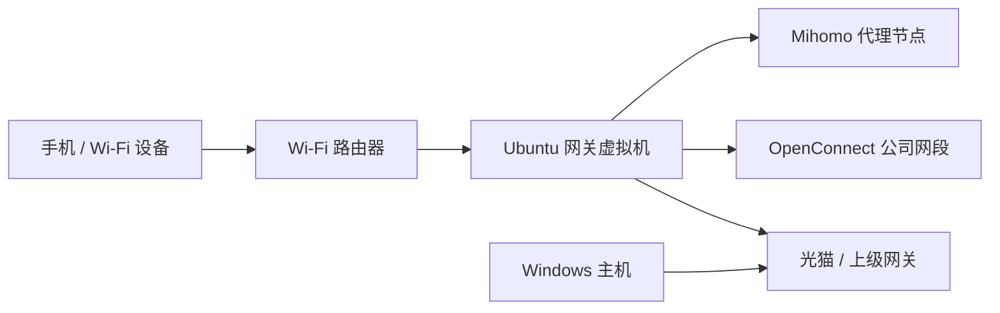

# Home Gateway

在 Windows Hyper-V 的 Ubuntu 虚拟机中运行 Mihomo 和 OpenConnect，让局域网设备共用代理、公司 VPN 和 DNS。以一个有线网口的家庭网关为目标，优先考虑日常维护和故障排查。



Wi-Fi 路由器的 WAN 网关和 DNS 指向虚拟机。Windows 主机可以继续使用上级网关，便于修复虚拟机。此项目只处理 IPv4；下游路由器应关闭 IPv6，避免流量绕开网关。

## 已实现

- OpenConnect 自动采用服务器下发的 IPv4 网段和 DNS，拒绝意外的全隧道路由。
- Mihomo 透明代理；公司网段优先走 VPN，普通流量采用完整 Clash 订阅中的节点、分组和规则。
- 每日更新订阅，保留本地网关配置、API 密钥和节点选择。更新失败继续使用上次有效配置；节点删除时按配置的地区筛选回退。
- MetaCubeXD 网页面板，在受限的局域网地址监听并要求 API 密钥。
- VPN 有限重试；Mihomo 最多重试三次。可分别查看日志、停止或手动重试。
- 配置只读挂载，镜像不含个人配置；部署先验证，再切换，已有部署失败时回退。
- GPG 加密状态备份，恢复订阅缓存、地区数据库和节点选择。

## 内容放在哪里

| 内容 | 位置 | Git 管理 |
|---|---|---|
| 镜像构建、网关逻辑、管理工具、示例 | 本仓库 | 公开 |
| 主机地址、VM 参数、VPN 服务端/用户名、凭据引用 | `~/.config/home-gateway`、`~/.config/vpn` | 私有 yadm |
| 订阅 URL、面板密钥、VPN 密码 | `pass` 中的 GPG 文件 | 私有 yadm |
| 渲染后的配置和密码 | VM `/opt/home-gateway/config` | 不进入公开仓库 |
| 订阅缓存、数据库、面板选择、日志 | VM `/opt/home-gateway/data` | 加密备份；日志不备份 |
| SSH/GPG 私钥、VM 磁盘、离线镜像 | 操作机独立存储 | 不进入 Git |

VM 中没有 yadm、个人 shell 配置或 GPG 私钥。操作机仅在部署时解密必要凭据，通过 SSH 发送；之后 VM 可以独立重启。

## 部署

操作机需要 Python 3.12+、PyYAML、SSH、GPG 和 pass。Windows 使用 WSL 运行部署工具，Hyper-V 管理使用 PowerShell。VM 使用 Ubuntu 24.04 amd64；Docker 使用主机网络和 TUN，故不适用于 Docker Desktop 的默认端口映射网络。

1. 将 `examples/deployment.example.json` 和 `examples/vpn-profiles.example.json` 的内容放入操作机的 `~/.config/home-gateway/deployment.json` 与 `~/.config/vpn/profiles.json`，填写本机参数。
2. 在 pass 中保存示例引用的凭据。将 SSH 私钥单独保存并固定 VM 的 SSH 主机密钥。
3. 下载并验证版本固定的公开组件：

   ```sh
   python3 tools/fetch-artifacts.py
   # 必要时增加 --proxy http://127.0.0.1:7897
   ```

4. 已有 VM 可以直接预检和部署：

   ```sh
   python3 tools/deploy.py --validate-only
   python3 tools/deploy.py
   ```

   Windows 对应 `./Deploy-Gateway.ps1 -ValidateOnly` 和 `./Deploy-Gateway.ps1`。

新建 VM 时先运行 `Prepare-VM.ps1`，再以管理员身份运行 `Initialize-VM.ps1`。网桥创建可能短暂中断主机网络；工具记录原始网络并带有恢复看门狗。首次 SSH 主机密钥应通过可信渠道核验，工具不自动接受变化。部署会在新 VM 中安装 Docker 和 PyYAML。

地址应在上级 DHCP 池之外；下游路由器的网关/DNS 需要手动指向 VM。完成验证后再调整下游路由器。

## 日常使用

```powershell
./Gateway.ps1 status
./Gateway.ps1 logs-vpn
./Gateway.ps1 retry-vpn
./Gateway.ps1 logs-clash
./Gateway.ps1 retry-clash
./Gateway.ps1 update-subscription
./Dashboard.ps1             # 建立本机 SSH 转发并复制面板密钥
./Dashboard.ps1 copy-key
```

局域网直接打开 `http://<VM-IP>:9090/ui/`。API 根路径返回 `Unauthorized` 是正常的；在面板中填写密钥。节点选择在面板里调整；分组和规则来自上游订阅。修改私有配置后重新部署。

维护与恢复：[docs/persistence.md](docs/persistence.md)。组件与故障边界：[docs/architecture.md](docs/architecture.md)。第三方许可：[THIRD_PARTY.md](THIRD_PARTY.md)。

## 验证与限制

```sh
python3 -m unittest discover -s tests -v
```

已有部署已验证代理、VPN、分流 DNS、节点选择和订阅失败回退；仓库提供自动化测试与 VM 内预检。基础镜像、Mihomo、面板和 Ubuntu cloud image 固定版本或摘要；apt 安装的包仍随软件源更新，构建不是逐字节可复现的。

它依赖 Windows 主机和 VM 正常运行。组件退出时普通直连可继续工作，公司网段不会在 VPN 断开时转向公网；整台主机或 VM 失效没有外部设备自动接管，需要把下游路由器的网关/DNS 改回上级网关。备份工具要求运行中的控制器可访问，以一致地记录节点选择。
